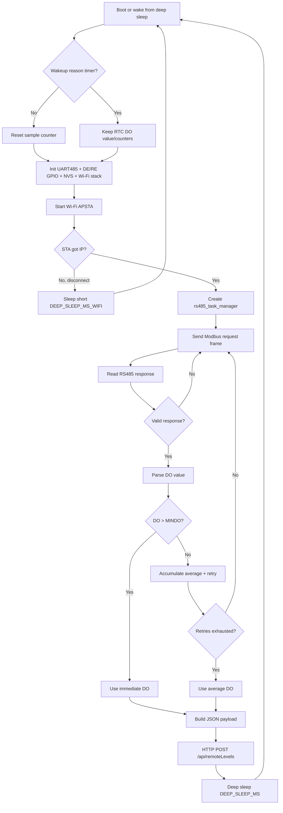

# APSTA Shrimp Architecture Diagrams

## System Architecture

```mermaid
flowchart LR
    subgraph HW[ESP32-S3 Device Layer]
        Sensor[DO Sensor Modbus/RS485]
        MAX485[MAX485 Transceiver\nDE=GPIO14, RE=GPIO13]
        UART[UART1 9600 Half-Duplex\nTX=GPIO42 RX=GPIO2]
        RTC[RTC Memory\ns_do_value_rtc, counters]
    end

    subgraph FW[Application Firmware]
        BOOT[app_main]
        INIT[Init: UART/GPIO, NVS, netif, event loop]
        WIFI[Wi-Fi AP+STA Mode]
        EVT[wifi_event_handler]
        TASK[rs485_task_manager]
        PARSE[DOHandler parse floats\n(temp, percent, do)]
        JSON[build_http_post_json]
        HTTP[HTTP POST /api/remoteLevels]
        SLEEP[enter_deep_sleep]
    end

    subgraph NET[Network]
        STA[STA uplink to router\nshrimp-p-001-u-01]
        AP[SoftAP DOSensor]
        API[HTTP Server\n192.168.4.1]
    end

    Sensor --> MAX485 --> UART --> TASK
    BOOT --> INIT --> WIFI --> EVT
    WIFI --> STA
    WIFI --> AP
    EVT -->|IP_EVENT_STA_GOT_IP| TASK
    TASK --> PARSE --> RTC --> JSON --> HTTP --> API
    EVT -->|WIFI_EVENT_STA_DISCONNECTED| SLEEP
    TASK -->|success/fallback average| SLEEP
```

## Runtime Flow


